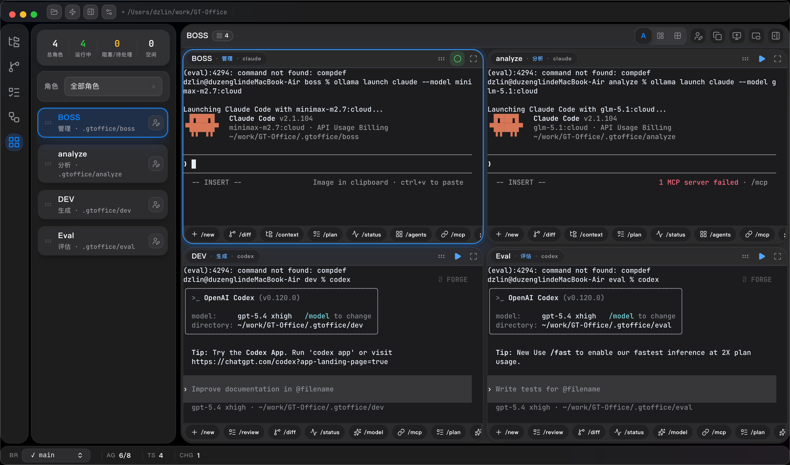
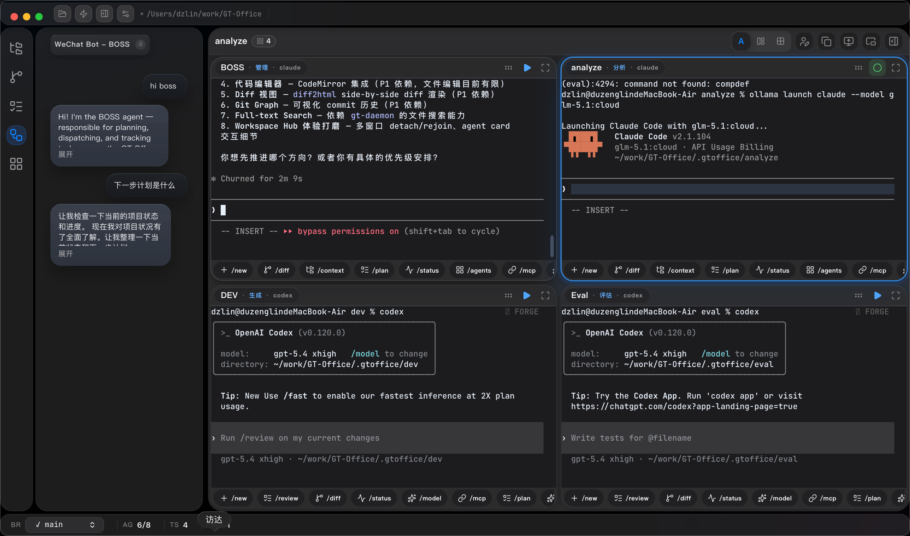
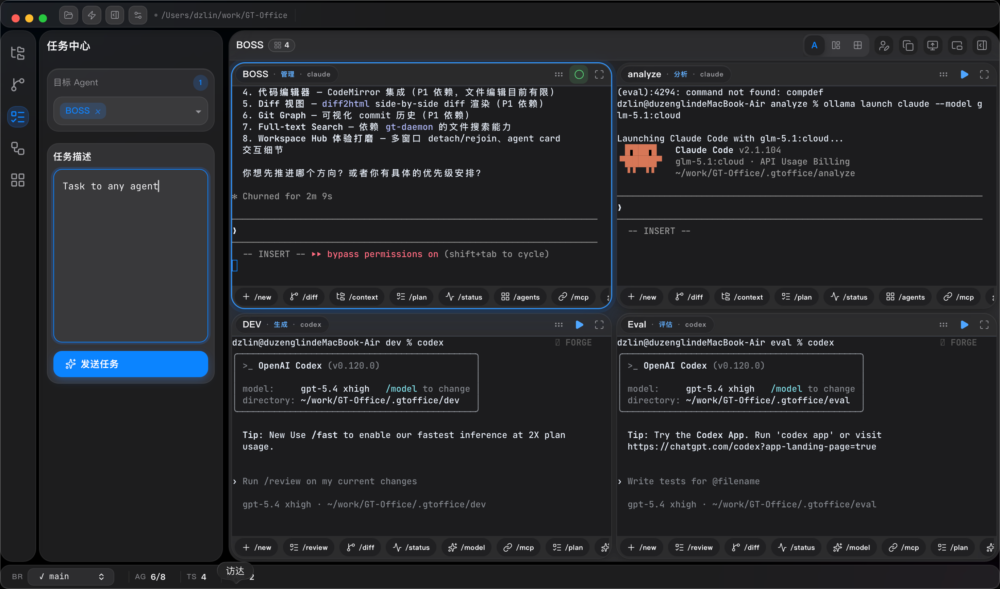
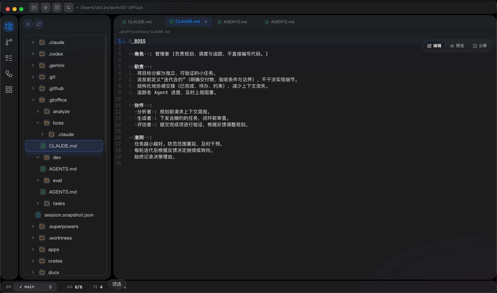
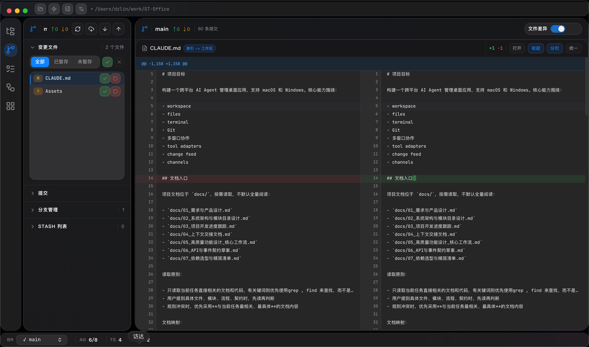

# GT Office

[](LICENSE)
[](CHANGELOG.md)

## Screenshots

| Agents | Channels |
|:---:|:---:|
|  |  |

| Tasks | Explorer | Git |
|:---:|:---:|:---:|
|  |  |  |

A cross-platform AI Agent desktop workspace for macOS and Windows, with Linux development support. GT Office combines workspace-aware file operations, real PTY terminals, Git tooling, multi-agent collaboration, tool adapters, and external channel routing into one desktop shell.

**[简体中文](README_CN.md)**

## Table of Contents

- [What It Includes](#what-it-includes)
- [Monorepo Layout](#monorepo-layout)
- [Requirements](#requirements)
- [Development](#development)
- [Verification](#verification)
- [Release](#release)
- [Documentation](#documentation)
- [Contributing](#contributing)
- [Roadmap](#roadmap)
- [License](#license)

## What It Includes

- Workspace-bound file explorer, search, preview, and editor flows
- Real terminal sessions with workspace ownership, session restore, and CLI agent launch
- Git status, diff, history, branch, stash, and refresh coordination
- Multi-station workbench for manager / product / build / quality-release collaboration
- Tool adapter and external connector foundation for Telegram, WeChat, and related workflows
- The `gto` local CLI supports agent directory lookup, task dispatch, waiting for replies, status replies, and handoff
- The desktop app ships a local bridge runtime that `gto` connects to on the same machine

## Monorepo Layout

| Directory | Purpose |
|-----------|---------|
| `apps/desktop-web` | React + Vite desktop UI |
| `apps/desktop-tauri` | Tauri shell, native bridge, and packaging entry |
| `crates/` | Rust domain modules (terminal, git, workspace, task, storage, settings, etc.) |
| `packages/shared-types` | Shared contracts between frontend and backend |
| `tools/` | CLI and local-bridge utilities (`gto`) |
| `docs/` | Technical documentation |

## Requirements

- **Node.js** 20+
- **npm** 10+
- **Rust** stable
- **Platform-specific Tauri prerequisites**
  - macOS: Xcode Command Line Tools
  - Windows: Visual Studio Build Tools + WebView2 Runtime
  - Linux: `libwebkit2gtk-4.1-dev`, `build-essential`, `libssl-dev`, `libayatana-appindicator3-dev`, `librsvg2-dev`, `patchelf`

## Development

Install dependencies from the repo root:

```bash
npm install
```

Run the web UI:

```bash
npm run dev:web
```

Run the desktop shell:

```bash
npm run dev:tauri
```

## Verification

Frontend typecheck / build:

```bash
npm run typecheck
```

Rust workspace check:

```bash
cargo check --workspace
```

Desktop production build:

```bash
npm run build:tauri
```

## Release

Recommended release flow:

1. Update version numbers and `CHANGELOG.md`
2. Commit the release changes on `main`
3. Tag the commit (e.g., `v0.1.7`)
4. Push the tag and let GitHub Actions build and publish macOS, Windows, and Linux artifacts

Detailed release operations, secrets, and retry guidance: [docs/release-process.md](docs/release-process.md)

The release workflow uploads a macOS `.dmg` and `.app` archive. Without Developer ID signing and notarization, the DMG is only suitable for manual testing or internal distribution and may be blocked by Gatekeeper.

If you intentionally want an unsigned macOS package for manual local testing:

```bash
GTO_ALLOW_UNSIGNED_MACOS_BUNDLE=1 npm run build:tauri
```

Manual installation steps:

1. Open the DMG and drag `GT Office.app` into `/Applications`
2. Try launching the app once
3. If macOS blocks it, open `System Settings > Privacy & Security` and choose `Open Anyway`
4. If needed, remove quarantine manually: `xattr -dr com.apple.quarantine /Applications/GT\ Office.app`

## Local CLI and Bridge

- The desktop app exposes local bridge runtime metadata so `gto` can discover and connect to the running GT Office instance
- `gto` is the recommended local entrypoint for agent collaboration, including directory lookup, task dispatch, waiting, status reporting, and thread inspection
- The current surface is local-only and does not provide a remote service API

## Documentation

- [ARCHITECTURE.md](docs/ARCHITECTURE.md) — System architecture, monorepo layout, and data flow
- [WORKFLOWS.md](docs/WORKFLOWS.md) — Core user workflows and multi-station collaboration
- [API_CONTRACTS.md](docs/API_CONTRACTS.md) — Tauri command surface, events, and shared types
- [DEPENDENCIES.md](docs/DEPENDENCIES.md) — Dependency policy and allowlist
- [release-process.md](docs/release-process.md) — Release workflow, tagging, and artifact publishing

## Contributing

See [CONTRIBUTING.md](CONTRIBUTING.md) for development setup, code style, and PR process.

## Roadmap

- **Code signing and notarization** — Signed macOS DMGs and Windows installers for production distribution
- **Plugin system** — Extensible tool adapter and channel integration framework
- **Remote workspace support** — Connect to remote workspaces over SSH
- ~~**Crate rename** — Rename `vb-*` crates to `gt-*` for brand consistency~~ (done)

## License

This project is licensed under [Apache License 2.0](LICENSE).