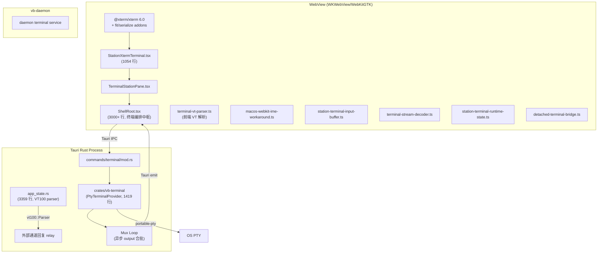
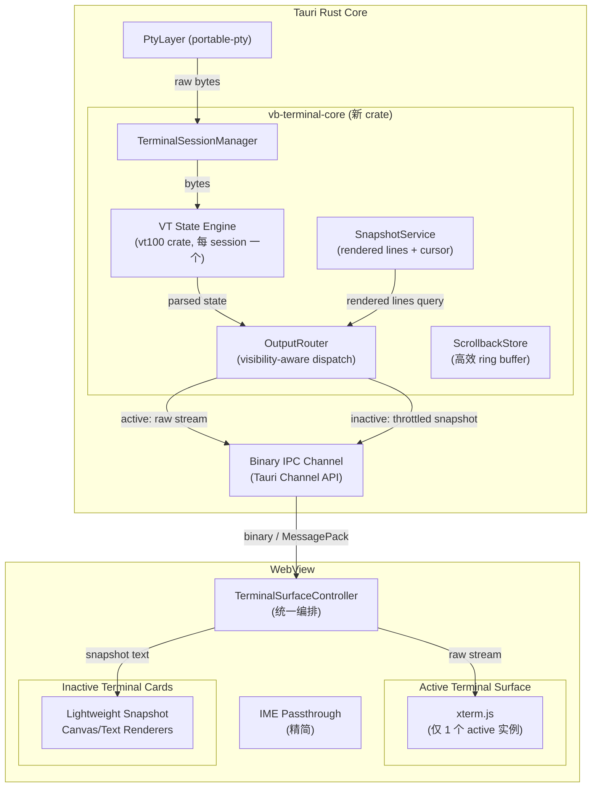

# GT Office 终端子系统终极重构方案

## 1. 现状分析

### 1.1 当前架构全景



### 1.2 已识别核心瓶颈

| 瓶颈 | 根因 | 影响范围 |
|---|---|---|
| **多终端 WebView 线程竞争** | 所有 xterm 实例共享 WKWebView 主线程，高频 PTY 输出 → base64 decode → `terminal.write()` → DOM repaint 全在同一线程 | 3+ 终端同时活跃时卡顿 |
| **base64 IPC 开销** | PTY 原始字节 → Rust `base64::encode` → Tauri `emit` JSON → 前端 `atob` → `TextDecoder` → xterm | 每个 chunk ~33% 体积膨胀 + 两端编解码 CPU |
| **ShellRoot 终端编排膨胀** | 3000+ 行的 ShellRoot 承载了 output cache、sink binding、visibility toggle、restore state、event dispatch… | 难维护，每次终端相关改动都触及 |
| **macOS WKWebView IME** | xterm textarea + WKWebView IME 不一致 → 200+ 行 workaround 代码 | 输入不可靠，频繁回归 |
| **焦点管理脆弱** | xterm 依赖 hidden textarea focus，WKWebView focus 管道不稳定 → retry loop（8帧重试） | 切换 station 时焦点丢失 |
| **VT 解析双重冗余** | 前端 xterm 维护完整 terminal state + 后端 `vt100::Parser` 为外部通道再解析一遍 | CPU 浪费、两份 truth 可能不一致 |
| **Serialize/Restore 链路** | 布局切换 → xterm serialize → 缓存 → 重建 → deserialize → fit → resize | 延迟大，恢复不完美 |
| **隐藏终端仍分配 xterm** | 即使 session 有效但 tab 非激活，xterm 实例仍存在于 DOM | 内存和 repaint 压力 |

### 1.3 对 Codex 方案的评价

Codex 提出的"Native Terminal Plane"方案目标正确，但落地方案存在以下实际问题：

| Codex 建议 | 问题 |
|---|---|
| 用 `alacritty_terminal` 做 canonical state | `alacritty_terminal` 是 Alacritty 内部 crate，API 不稳定、没有独立版本策略、文档极少 |
| Native terminal window 替代 WebView 内终端 | Tauri v2 不支持 child webview 嵌入原生 surface，独立窗口意味着**完全脱离工作台交互上下文**（无法拖拽、无法与卡片布局联动、无法统一主题） |
| "直接转向，不再投资 WebView 内终端" | 忽略了你们已有的 station card 体系、detached window 桥接、外部通道 relay 等大量 xterm 深度集成 |
| 前端只展示"低频摘要" | 违背产品定位——终端是核心交互面，用户需要在工作台内直接操作终端 |

**结论**：Codex 方案的概念方向合理（后端 canonical state + 减轻 WebView 负担），但执行策略不实际。应该采取**渐进式架构提升**而非一刀切推翻。

---

## 2. 重构目标

1. **多终端性能**：同时运行 6+ 终端不卡顿
2. **保持产品一致性**：终端仍在工作台 WebView 内交互，不打破 station card 体系
3. **降低前端复杂度**：ShellRoot 终端编排代码量减半
4. **消除 IME/焦点问题**：从根源减少 WKWebView 特有的 workaround
5. **统一 terminal state**：后端成为唯一 truth，消除前后端双重 VT 解析
6. **渐进式落地**：每个阶段独立可验证，不需要 big-bang 切换

---

## 3. 终极架构设计

### 3.1 架构总览



### 3.2 核心设计决策

#### 决策 1：Active-Only xterm + Backend Canonical State

- **只有当前聚焦的终端**挂载真正的 xterm.js 实例
- 所有非活跃终端由后端 VT engine 维护 canonical state
- 非活跃卡片显示轻量 snapshot 预览（纯文本/canvas）
- 切换 active station 时：
  1. 旧 active xterm 写入后端 scrollback（不销毁 xterm，复用实例）
  2. 从后端读取新 session 的 rendered screen（已解析的行+光标位置）
  3. xterm reset + write rendered content
  4. 后端标记新 session 为 active → 直接转发原始字节流

**效果**：从 N 个 xterm 实例降为常数个（1-2），WebView 主线程压力降 80%+。

#### 决策 2：Binary IPC 替代 base64 JSON

现有链路：
```
PTY bytes → Rust base64 encode → JSON serialize → Tauri emit → JS JSON parse → atob → TextDecoder → xterm
```

新链路：
```
PTY bytes → Tauri Channel API (binary) → JS ArrayBuffer → xterm.write(Uint8Array)
```

- Tauri v2 的 [Channel API](https://v2.tauri.app/develop/calling-rust/#channels) 支持直接传递二进制数据
- 消除 base64 编解码开销（~33% 带宽 + CPU 节省）
- xterm.js v6 原生支持 `write(Uint8Array)`

#### 决策 3：后端 VT State Engine 统一 truth

- 每个 session 在后端维护一个 `vt100::Parser`（已有依赖 `vt100 = "0.15"`）
- `RenderedScreenSnapshot` 改为从后端 VT state 生成，不再依赖前端 xterm buffer 回传
- 外部通道 relay（Telegram/飞书/微信）直接读后端 VT state，不再需要前端 `terminal_report_rendered_screen` 回路
- `terminal-vt-parser.ts`（前端 VT 解析）可废弃

#### 决策 4：保留 xterm.js，不引入 Native Surface

原因：
1. Tauri v2 没有成熟的 native surface embedding API
2. xterm.js v6 + WebGL renderer 在单实例场景下性能足够
3. 保持 station card 布局、主题、快捷键系统的一致性
4. 避免引入 `alacritty_terminal`（不稳定 API）或自建渲染管道的巨大风险

---

## 4. 分层模块设计

### 4.1 Rust 后端

#### 4.1.1 `crates/vb-terminal-core`（新 crate）

> [!IMPORTANT]
> 这是整个重构的核心，将现有 `vb-terminal` 中的 mux loop、flow state、ring buffer 与新的 VT engine 合并为一个高内聚 crate。

```
crates/vb-terminal-core/
├── Cargo.toml
├── src/
│   ├── lib.rs                    # 公共 API
│   ├── session.rs                # TerminalSession 生命周期
│   ├── pty.rs                    # PTY spawn/IO（从 vb-terminal 迁移）
│   ├── vt_engine.rs              # VT state wrapper (基于 vt100 crate)
│   ├── output_router.rs          # Visibility-aware output dispatch
│   ├── snapshot.rs               # Rendered screen snapshot 生成
│   ├── scrollback.rs             # 高效 scrollback ring buffer
│   ├── input.rs                  # 输入写入 + backpressure
│   ├── process_tree.rs           # 进程树查询（从 vb-terminal 迁移）
│   └── flow_control.rs           # 合批 + 水位控制
└── tests/
    ├── session_tests.rs
    ├── vt_engine_tests.rs
    ├── output_router_tests.rs
    └── snapshot_tests.rs
```

**核心结构**：

```rust
/// 每个终端 session 的完整后端状态
pub struct TerminalSessionState {
    session_id: String,
    workspace_id: String,
    resolved_cwd: String,
    
    // PTY runtime
    pty_writer: Box<dyn Write + Send>,
    pty_master: Box<dyn MasterPty + Send>,
    child: Box<dyn portable_pty::Child + Send>,
    
    // VT canonical state (替代前端 xterm buffer 作为 truth)
    vt_parser: vt100::Parser,
    
    // Output routing
    visibility: SessionVisibility,
    output_seq: u64,
    
    // Scrollback
    scrollback: ScrollbackStore,
}

pub enum SessionVisibility {
    /// 当前 active session — 原始字节流直接转发到前端 xterm
    Active,
    /// 可见但非 active — 低频 snapshot 推送
    Visible,  
    /// 不可见 — 只维护 VT state，不推送
    Hidden,
}

/// 从后端 VT state 生成的 rendered screen，替代前端回传
pub struct RenderedScreen {
    pub session_id: String,
    pub revision: u64,
    pub rows: Vec<RenderedRow>,
    pub cursor_row: u32,
    pub cursor_col: u32,
    pub scrollback_lines: u32,
    pub title: Option<String>,
}

pub struct RenderedRow {
    pub text: String,
    pub is_wrapped: bool,
}
```

**OutputRouter 核心逻辑**：

```rust
impl OutputRouter {
    /// PTY 产出 bytes 后的分发逻辑
    pub fn dispatch_output(&mut self, session_id: &str, chunk: &[u8]) {
        let session = self.sessions.get_mut(session_id)?;
        
        // 1. 始终更新 VT canonical state
        session.vt_parser.process(chunk);
        session.scrollback.push(chunk);
        session.output_seq += 1;
        
        match session.visibility {
            SessionVisibility::Active => {
                // 2a. Active: 直接转发原始字节到前端 xterm
                self.send_raw_output(session_id, chunk, session.output_seq);
            }
            SessionVisibility::Visible => {
                // 2b. Visible: 合批后推送低频 snapshot delta
                session.pending_snapshot_dirty = true;
                // snapshot 推送由定时 tick 触发，不阻塞 PTY 读循环
            }
            SessionVisibility::Hidden => {
                // 2c. Hidden: 只更新统计，不推送
                session.hidden_unread_bytes += chunk.len() as u64;
            }
        }
    }
}
```

#### 4.1.2 `crates/vb-terminal`（瘦化）

保留为**兼容层 + 公共接口**，内部委托到 `vb-terminal-core`：

```rust
// vb-terminal/src/lib.rs — 瘦化后仅保留 trait 实现 + 公共类型导出
pub use vb_terminal_core::{
    TerminalSessionState, RenderedScreen, RenderedRow,
    TerminalSnapshotChunk, TerminalDeltaChunk,
    TerminalSessionProcessSnapshot, TerminalSessionProcessInfo,
};
```

#### 4.1.3 Tauri Command Layer 变更

[commands/terminal/mod.rs](file:///Users/dzlin/work/GT-Office/apps/desktop-tauri/src-tauri/src/commands/terminal/mod.rs) 调整：

| 命令 | 变更 |
|---|---|
| `terminal_create` | 不变 |
| `terminal_write` | 不变 |
| `terminal_resize` | 不变 |
| `terminal_kill` | 不变 |
| `terminal_set_visibility` | 扩展为三态：`active` / `visible` / `hidden` |
| `terminal_read_snapshot` | **删除** — snapshot 改为 push 模式 |
| `terminal_read_delta` | **删除** — delta 改为 Tauri Channel push |
| `terminal_report_rendered_screen` | **删除** — 后端自己生成 rendered screen |
| **新增** `terminal_get_rendered_screen` | 按需从后端 VT state 读取 rendered screen |
| **新增** `terminal_activate` | 切换 active session，触发 xterm restore |
| **新增** `terminal_open_output_channel` | 建立 Tauri Binary Channel 用于输出推送 |

**Binary Channel 建立**：

```rust
#[tauri::command]
pub fn terminal_open_output_channel(
    session_id: String,
    channel: tauri::ipc::Channel<Vec<u8>>,  // Tauri v2 Binary Channel
    state: State<'_, AppState>,
) -> Result<Value, String> {
    state.terminal_core.register_output_channel(
        &session_id,
        channel,
    ).map_err(|e| e.to_string())?;
    
    Ok(json!({ "sessionId": session_id, "channelBound": true }))
}
```

### 4.2 前端

#### 4.2.1 `features/terminal/` 目录重构

```
features/terminal/
├── index.ts
├── TerminalSurfaceController.ts      # 新：统一终端面控制器
├── ActiveTerminalSurface.tsx          # 新：Active xterm 渲染面
├── InactiveTerminalSnapshot.tsx       # 新：非活跃终端 snapshot 预览
├── terminal-output-channel.ts         # 新：Binary Channel 接收层
├── terminal-activation.ts             # 新：active session 切换逻辑
├── StationXtermTerminal.tsx           # 简化 → 委托 ActiveTerminalSurface
├── station-terminal-runtime-state.ts  # 保留，微调
├── station-terminal-input-buffer.ts   # 保留
├── terminal-stream-decoder.ts         # 废弃 → binary channel 不需要 base64 解码
├── terminal-vt-parser.ts             # 废弃 → 后端统一 VT 解析
├── macos-webkit-ime-workaround.ts    # 保留但大幅精简
├── station-terminal-document-scope.ts # 保留
├── station-terminal-idle-banner.ts    # 保留
├── station-terminal-restore-state.ts  # 废弃 → 后端 rendered screen 替代 serialize/restore
├── StationXtermTerminal.scss         # 保留
├── terminal-debug-model.ts           # 保留
├── terminal-debug-store.ts           # 保留
├── terminal-human-log.ts             # 保留
├── TerminalDebugPanel.tsx            # 保留
└── TerminalDebugPanel.scss           # 保留
```

#### 4.2.2 `TerminalSurfaceController` — 核心编排器

> [!IMPORTANT]
> 这是前端重构的核心。将 ShellRoot 中散落的 3000+ 行终端编排逻辑收拢到一个独立的、与 React 渲染无关的控制器中。

```typescript
/**
 * TerminalSurfaceController
 * 
 * 职责：
 * 1. 管理所有 session 的 output channel（Binary Channel）
 * 2. 管理 active session 切换（xterm re-hydrate）
 * 3. 管理 inactive session 的 snapshot 预览更新
 * 4. 将 ShellRoot 中的终端编排逻辑隔离出来
 * 
 * 不负责：
 * - React 渲染（由 ActiveTerminalSurface / InactiveTerminalSnapshot 组件负责）
 * - Session 生命周期（由 station-action-registry 和 ShellRoot 负责）
 * - 输入发送（由 station-terminal-input-buffer 负责）
 */
export class TerminalSurfaceController {
  private activeSessionId: string | null = null
  private channels = new Map<string, OutputChannel>()
  private xtermSink: XtermSink | null = null
  private snapshotSubscribers = new Map<string, SnapshotCallback>()
  
  /** 切换 active session */
  async activateSession(sessionId: string): Promise<void> {
    // 1. 通知后端新 session 变为 active
    await invoke('terminal_activate', { sessionId })
    // 2. 读取后端 rendered screen
    const screen = await invoke('terminal_get_rendered_screen', { sessionId })
    // 3. 将 rendered screen 写入 xterm
    this.xtermSink?.restore(screen)
    // 4. 打开 binary output channel
    this.ensureOutputChannel(sessionId)
    this.activeSessionId = sessionId
  }
  
  /** 通过 Tauri Binary Channel 接收 active session 的原始输出 */
  private handleActiveOutput(chunk: Uint8Array): void {
    this.xtermSink?.write(chunk)
  }
  
  /** 接收 inactive session 的 snapshot 更新 */
  private handleSnapshotUpdate(sessionId: string, snapshot: RenderedSnapshot): void {
    this.snapshotSubscribers.get(sessionId)?.(snapshot)
  }
}
```

#### 4.2.3 `ActiveTerminalSurface` 组件

精简后的 xterm 渲染面，只负责 xterm 实例管理：

```typescript
/**
 * 职责：
 * - 管理唯一的 xterm.js 实例
 * - 将 raw bytes (Uint8Array) 写入 xterm
 * - 将用户输入 data 回调给 controller
 * - 响应 resize 回调
 * - 极简 IME 处理（macOS WKWebView 特定）
 * 
 * 显著减少：
 * - 不再负责 serialize/restore（后端提供 rendered screen）
 * - 不再负责 rendered screen snapshot 抓取和上报
 * - 焦点管理精简（单实例无竞争）
 */
function ActiveTerminalSurface({
  controller,
  sessionId,
  appearanceVersion,
  onData,
  onResize,
}: Props) {
  // xterm 实例复用：不随 sessionId 销毁重建
  // 切换 session 时由 controller 调 restore
}
```

#### 4.2.4 `InactiveTerminalSnapshot` 组件

```typescript
/**
 * 非活跃终端的轻量预览。
 * 不挂载 xterm.js，只渲染后端推送的 snapshot 文本。
 * 
 * 实现选项（按优先级）：
 * 1. 纯 <pre> 文本 + CSS — 最轻量
 * 2. 小型 canvas 渲染 — 如果需要 ANSI 颜色
 * 3. xterm-headless + custom renderer — 如果需要完整 VT 语义
 * 
 * 推荐方案 1（纯文本），因为非活跃卡片不需要交互能力。
 */
function InactiveTerminalSnapshot({
  sessionId,
  snapshot, // 来自 controller 的 RenderedSnapshot
  onActivate,
}: Props) {
  return (
    <div className="terminal-snapshot" onClick={onActivate}>
      <pre>{snapshot?.lastLines ?? ''}</pre>
      <div className="terminal-snapshot-overlay">
        {/* 半透明遮罩 + 点击提示 */}
      </div>
    </div>
  )
}
```

### 4.3 IPC 协议变更

#### 4.3.1 Active Session 输出（Binary Channel）

```
后端 → 前端：Tauri Channel<Vec<u8>>
- 零 base64 序列化
- 直接推送 PTY 原始字节
- 前端 xterm 直接写入 Uint8Array
```

#### 4.3.2 Inactive Session Snapshot（Tauri Event）

```json
// 事件名: "terminal/snapshot"
// 低频：每 300ms 最多一次
{
  "sessionId": "term:ws1:3",
  "revision": 42,
  "lastLines": "$ npm run build\n✓ Built in 2.3s\n$",
  "cursorRow": 2,
  "totalLines": 150,
  "unreadBytes": 0
}
```

#### 4.3.3 Session 切换协议

```
前端 → 后端: terminal_activate(sessionId)
后端: 
  1. 旧 active → Visible/Hidden（停止 raw stream push）
  2. 新 active → Active（开始 raw stream push）
  3. 生成新 session 的 rendered screen
后端 → 前端: RenderedScreen（作为 terminal_activate 的返回值）
前端:
  1. xterm.reset()
  2. xterm.write(renderedScreen.content)
  3. 打开 Binary Channel 接收后续输出
```

---

## 5. 关键实现细节

### 5.1 VT Engine 包装

```rust
// vb-terminal-core/src/vt_engine.rs

use vt100::Parser;

/// 对 vt100::Parser 的轻量包装，提供 GT Office 需要的查询接口
pub struct VtEngine {
    parser: Parser,
    cols: u16,
    rows: u16,
}

impl VtEngine {
    pub fn new(cols: u16, rows: u16) -> Self {
        Self {
            parser: Parser::new(rows, cols, 4000), // 4000 行 scrollback
            cols,
            rows,
        }
    }
    
    pub fn process(&mut self, bytes: &[u8]) {
        self.parser.process(bytes);
    }
    
    pub fn resize(&mut self, cols: u16, rows: u16) {
        self.parser.set_size(rows, cols);
        self.cols = cols;
        self.rows = rows;
    }
    
    /// 生成 rendered screen — 替代前端 xterm buffer 遍历 + 上报
    pub fn rendered_screen(&self) -> RenderedScreen {
        let screen = self.parser.screen();
        let mut rows = Vec::with_capacity(self.rows as usize);
        for row_idx in 0..self.rows {
            let row = screen.row(row_idx);
            rows.push(RenderedRow {
                text: row.text(),
                is_wrapped: row.wrapped(),
            });
        }
        RenderedScreen {
            rows,
            cursor_row: screen.cursor_position().0 as u32,
            cursor_col: screen.cursor_position().1 as u32,
            scrollback_lines: screen.scrollback() as u32,
            title: screen.title().map(String::from),
        }
    }
    
    /// 为 xterm restore 生成完整的 terminal content
    /// 包括 scrollback + 当前 viewport
    pub fn serialized_content(&self) -> Vec<u8> {
        let screen = self.parser.screen();
        screen.contents_formatted().into_bytes()
    }
}
```

### 5.2 外部通道 Relay 简化

当前 app_state.rs 中的 `ExternalReplyRelaySession` 每个都维护一个独立的 `vt100::Parser`（行 683）。重构后：

```rust
// 重构前：每个 relay session 独立 VT parser
ExternalReplyRelaySession {
    vt_parser: vt100::Parser::new(36, 120, 500),  // 冗余！
    last_rendered_snapshot: Option<RenderedScreenSnapshot>,
    ...
}

// 重构后：直接从 vb-terminal-core 的 session state 读取
ExternalReplyRelaySession {
    // 删除 vt_parser
    // 删除 last_rendered_snapshot
    // 改为：
    session_id: String,  // 引用 terminal-core 的 session
    ...
}

impl AppState {
    fn get_external_reply_rendered_screen(&self, session_id: &str) -> Option<RenderedScreen> {
        // 直接从 terminal-core 的 VT engine 读取
        self.terminal_core.get_rendered_screen(session_id)
    }
}
```

**效果**：
- 删除 app_state.rs 中 ~500 行的 rendered screen 处理和 VT 解析逻辑
- 消除前端 `terminal_report_rendered_screen` 回路
- 外部通道 reply 数据源质量更高（不依赖前端 xterm 快照）

### 5.3 macOS IME Workaround 精简

当前 200+ 行的 IME workaround 主要解决"多个 xterm 实例的 textarea 焦点竞争"。当降为 1 个 active xterm 后：

- `shouldBypassXtermTextKeyEvent` — **保留**（WKWebView keyCode 229 问题仍存在）
- `resolveDeferredMacOsTextInputHandling` — **保留但简化**（无多实例竞争）
- `consumeDeferredMacOsXtermEcho` — **保留**
- focus retry loop（8帧重试）— **大幅简化**（单实例无竞争）

预计代码量从 ~400 行（workaround + StationXtermTerminal 中相关逻辑）减少到 ~150 行。

### 5.4 ShellRoot 终端编排代码迁移

ShellRoot 中与终端相关的逻辑将迁移到 `TerminalSurfaceController`：

| ShellRoot 中的逻辑 | 迁移目标 |
|---|---|
| `stationTerminalOutputCacheRef` | `TerminalSurfaceController.channels` |
| `appendStationTerminalOutput` | `TerminalSurfaceController.handleActiveOutput` |
| `resetStationTerminalOutput` | `TerminalSurfaceController.activateSession` |
| `terminal/output` event listener | `TerminalSurfaceController` 内部 |
| `terminal/state` event listener | `TerminalSurfaceController` 内部 |
| `terminal/meta` event listener | `TerminalSurfaceController` 内部 |
| sink binding / unbinding | `TerminalSurfaceController.xtermSink` |
| detached terminal bridge output sync | `TerminalSurfaceController` 内部 |
| rendered screen snapshot 上报 | **删除**（后端自生成） |

预计从 ShellRoot 移除 ~800-1000 行终端编排代码。

---

## 6. 落地阶段

### Phase 1：后端 VT Engine + Binary Channel（2-3 周）

> [!IMPORTANT]
> 这一阶段是基础设施，不改变前端行为。完成后前端可以选择性接入。

**目标**：创建 `vb-terminal-core` crate，集成 VT engine，实现 Binary Channel 推送。

**具体任务**：
1. 创建 `crates/vb-terminal-core/`，搬迁 `vb-terminal` 中的 session/mux/process_tree 逻辑
2. 为每个 session 添加 `vt100::Parser` VT state
3. 实现 `OutputRouter` 三态分发
4. 实现 `RenderedScreen` 从 VT state 生成
5. 新增 `terminal_open_output_channel` Tauri command（Binary Channel）
6. 新增 `terminal_activate` / `terminal_get_rendered_screen` commands
7. **旧 API 全部保留**，新旧并行

**验证**：
- `cargo test -p vb-terminal-core`——VT engine 解析正确性
- `cargo test -p gtoffice-desktop-tauri`——现有终端测试不 break
- 手动验证：旧前端 + 新后端仍然工作

**依赖变更**：
- 新增 `vb-terminal-core` crate（内部依赖 `vt100 = "0.15"`，已在项目中）
- `vb-terminal` 改为依赖 `vb-terminal-core`

### Phase 2：前端 Active-Only xterm（2 周）

**目标**：前端改为 1 个 active xterm 实例 + inactive snapshot 预览。

**具体任务**：
1. 实现 `TerminalSurfaceController`
2. 实现 `ActiveTerminalSurface`（xterm 实例复用）
3. 实现 `InactiveTerminalSnapshot`（纯文本预览）
4. 修改 `TerminalStationPane`：根据 active 状态选择渲染 active surface 或 snapshot
5. 接入 Binary Channel 替代 base64 event
6. 从 ShellRoot 迁出终端编排逻辑到 TerminalSurfaceController
7. 废弃 `terminal-stream-decoder.ts`、`terminal-vt-parser.ts`、`station-terminal-restore-state.ts`

**验证**：
- `npm run typecheck`
- `npm run build`
- 手动验证：切换 station 时终端内容保持
- 手动验证：inactive 卡片显示最近输出预览
- macOS 环境：IME 输入正常

### Phase 3：外部通道 Relay 统一 + 清理（1 周）

**目标**：app_state 中的外部通道回复改为从后端 VT engine 读取。

**具体任务**：
1. `ExternalReplyRelaySession` 删除内部 `vt100::Parser`
2. `report_external_reply_rendered_screen` 改为从 `vb-terminal-core` 读取
3. 前端删除 `terminal_report_rendered_screen` 调用
4. 删除前端 `onRenderedScreenSnapshot` 回调链路
5. 清理 ShellRoot 中残留的终端编排代码

**验证**：
- `cargo test -p gtoffice-desktop-tauri`——外部通道 reply 测试通过
- 手动验证：Telegram/飞书通道回复内容正确
- `npm run typecheck`、`npm run build`

### Phase 4：性能调优 + 收口（1 周）

**目标**：性能极致优化和代码清理。

**具体任务**：
1. Output 合批窗口调优（当前 12ms → 根据 active/visible 差异化）
2. Scrollback 内存上限配置化
3. WebGL renderer 启用评估（xterm.js v6 支持）
4. 清理旧代码（`terminal_read_snapshot`、`terminal_read_delta` 等旧 API）
5. 更新文档 `docs/02`、`docs/06`

---

## 7. 性能提升预估

| 指标 | 现状 | 重构后 | 提升 |
|---|---|---|---|
| WebView 中 xterm 实例数 | N（= station 数） | 1-2 | -80%+ DOM 节点 |
| 每 chunk IPC 体积 | raw × 1.33（base64） | raw × 1（binary） | -25% 带宽 |
| base64 编解码 CPU | 每 chunk 2 次 | 0 | 消除 |
| VT 解析次数/chunk | 2（前端 xterm + 后端 vt100） | 1（后端 vt100） | -50% |
| ShellRoot 终端代码行 | ~1000 行 | ~200 行 | -80% |
| macOS IME workaround | ~400 行 | ~150 行 | -60% |
| 前端 rendered screen 上报 | 每 280ms/session | 0 | 消除回路 |
| 终端切换延迟 | serialize → destroy → recreate → deserialize | 后端 rendered screen → reset + write | -70% |

---

## 8. 风险与缓解

| 风险 | 影响 | 缓解措施 |
|---|---|---|
| `vt100` crate 与 xterm.js 渲染不一致 | 切换 session 时内容偏差 | Phase 1 增加对比测试：同一输入流过 vt100 和 xterm 比较 rendered output |
| Binary Channel 在 Tauri v2 的稳定性 | 大数据量推送可能丢帧 | 保留 base64 JSON fallback 路径，运行时可切换 |
| Active xterm 实例复用时的状态泄漏 | 切换 session 后旧 session 的 ANSI mode/颜色残留 | 切换时调用 `terminal.reset()` 后再 write rendered content |
| 外部通道 relay 改为后端 VT state 后回归 | Telegram/飞书回复内容异常 | Phase 3 独立于 Phase 2，可回滚 |

---

## 9. 不做的事情

> [!WARNING]
> 以下事项明确排除在本次重构之外。

1. **不引入 `alacritty_terminal`** — API 不稳定，`vt100` crate 已满足需求且项目中已有依赖
2. **不开 native terminal window** — 破坏产品一致性，Tauri v2 无成熟方案
3. **不全量重写前端 terminal feature** — 渐进式迁移，每个 Phase 独立可验证
4. **不引入新的 UI 框架** — 保持 React + xterm.js 栈
5. **不做 terminal multiplexer**（类似 tmux）— 超出当前需求
6. **不做 terminal recording/replay** — 超出当前需求

---

## 10. 开放问题

> [!IMPORTANT]
> 以下问题需要你的确认再开始实施。

1. **Phase 优先级**：是否同意 Phase 1（后端 VT Engine）先行
 同意 Phase 1（后端 VT Engine）先行

2. **Inactive terminal 预览形式**：
我：- A. 纯文本 `<pre>`（最轻量，推荐）

3. **Binary Channel 降级策略**：Tauri Channel API 如果在某些 WebView 版本有问题，是否保留 base64 JSON 作为 fallback？ 你选择最合适的方案

4. **`vb-terminal` 和 `vb-terminal-core` 的关系**：
   - A. 保留 `vb-terminal` 为公共接口层 + `vb-terminal-core` 为实现层（推荐）

5. **Detached terminal window**：重构后 detached window 的终端预览是否也改为 snapshot 模式？还是 detached window 中也挂载独立 xterm？你选择最合适的方案
